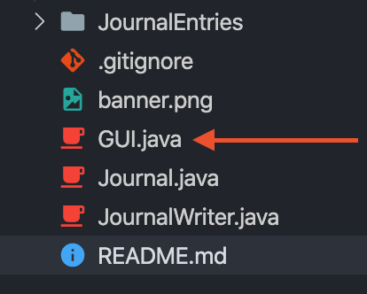
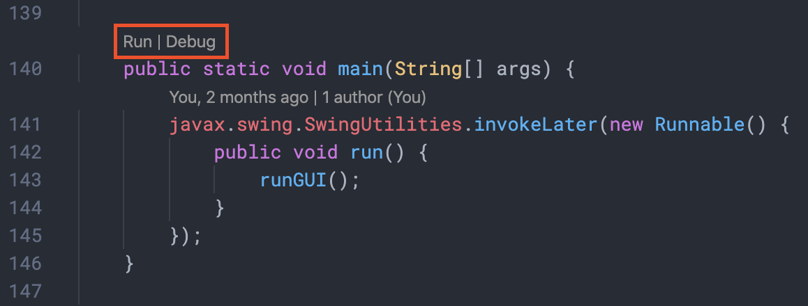

# Journal Demo
Simple Journal application. Made in Java and uses a GUI interface.

See a video demo 

## Usage
The following steps use VSCode with the Java Extension Pack installed but the program should run in any Java IDE.

**1. Clone the Repo**

 

**2. Open GUI.java**

 

**3. Go to line 140 and press 'Run'**

The program should have opened up now!
